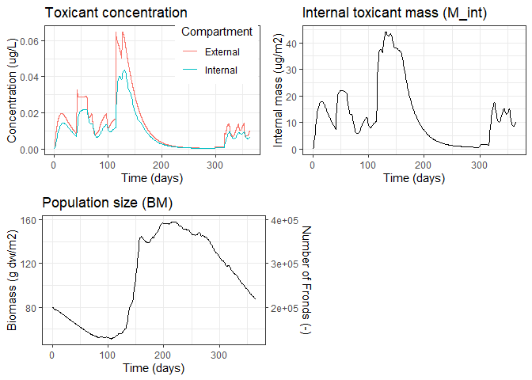

<!-- README.md is generated from README.Rmd. Please edit that file -->

# lemna

<!-- badges: start -->
<!-- badges: end -->

## Overview

*lemna* is a software package for the language
[*R*](https://www.r-project.org/). It implements model equations and
default parameters to simulate the toxicokinetic-toxicodynamic (TKTD)
model of the *Lemna* aquatic plant. *Lemna* is a standard test
macrophyte used in ecotox effect studies. The model was described and
published by the *SETAC Europe Interest Group Effect Modeling* (Klein
*et al.* 2022). It is a refined description of the *Lemna* TKTD model
published by Schmitt *et al.* (2013). This package contains the model’s
reference implementation which is provided by the *SETAC* interest
group.

## Installation

``` r
## install directly from CRAN
install.packages("lemna")

## install latest development version from GitHub
#install.packages("remotes")
remotes::install_github("nkehrein/lemna", dependencies=TRUE)
```

## Usage

The lemna package provides model equations and some useful helpers to
simulate the growth of *Lemna* (duckweed) aquatic plant populations. A
simulation is run by using the `lemna()` function. The required scenario
data are either supplied individually on function call or are passed as
a pre-defined scenario object, such as the `focusd1` sample scenario:

``` r
library(lemna)

# simulate sample scenario
result <- lemna(focusd1)
head(result)
#>   time       BM     M_int        C_int  FrondNo
#> 1    0 80.00000 0.0000000 0.0000000000 200000.0
#> 2    1 79.48177 0.6614503 0.0004983256 198704.4
#> 3    2 79.00414 2.2061048 0.0016720907 197510.3
#> 4    3 78.57538 4.1750616 0.0031817050 196438.5
#> 5    4 78.23362 6.2899397 0.0048143381 195584.0
#> 6    5 78.01035 8.3810150 0.0064332127 195025.9

plot(result)
```



## Learning lemna

The package contains two vignettes that may help you getting started:

-   [Introduction to the Lemna
    package](https://nkehrein.github.io/lemna/lemna-introduction.html)<br />
    A general *Tutorial* and guide to the package functions
-   [Lemna model
    verification](https://nkehrein.github.io/lemna/lemna-verification.html)<br />
    A verification of the model implementation against results of the
    Schmitt *et al.* implementation. Contains advanced workflows of
    package features.

## License

The package and its source code is free and open-source software
available under the MIT license.

## Issues

If you find any issues or bugs within the package, please create a [new
issue](https://github.com/nkehrein/lemna/issues) on GitHub.

## References

-   Klein J., Cedergreen N., Heine S., Kehrein N., Reichenberger S.,
    Rendal C., Schmitt W., Hommen U., 2022: Refined description of the
    *Lemna* TKTD growth model based on *Schmitt et al.* (2013) –
    equation system and default parameters, implementation in R. Report
    of the working group *Lemna* of the SETAC Europe Interest Group
    Effect Modeling. Version 1.1, uploaded on 09 May 2022.
    <https://www.setac.org/group/SEIGEffectModeling>
-   Schmitt W., Bruns E., Dollinger M., Sowig P., 2013: Mechanistic
    TK/TD-model simulating the effect of growth inhibitors on *Lemna*
    populations. Ecol Model 255, pp. 1-10. DOI:
    [10.1016/j.ecolmodel.2013.01.017](https://doi.org/10.1016/j.ecolmodel.2013.01.017)
